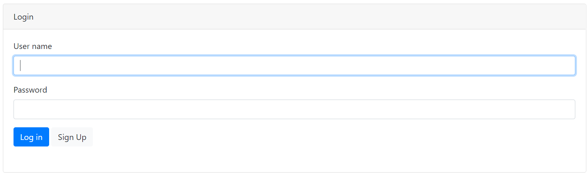
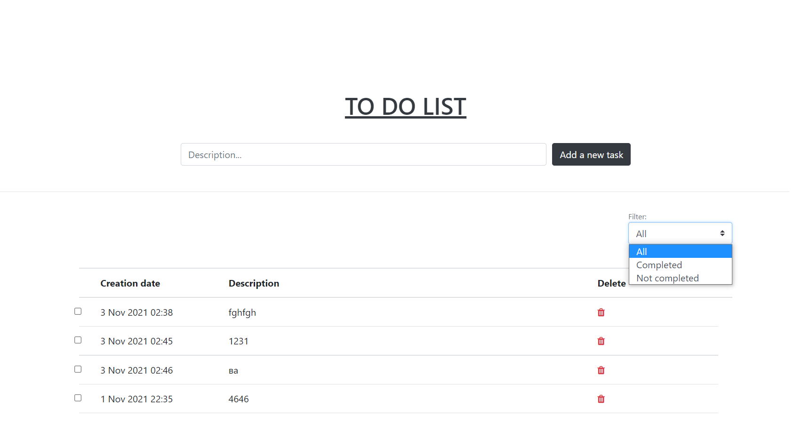

# job4j_todo

Проект представляет собой приложение "TODO список". На главной странице отображается список 
задач с датой создания, описанием, чек-боксом "Выполнено/ Не выполнено".

Чтобы добавить новую задачу, необходимо заполнить описание и нажать кнопку "Add a new task".
По фильтру можно выбрать список выполненных, невыполненных задач или отобразить все.

