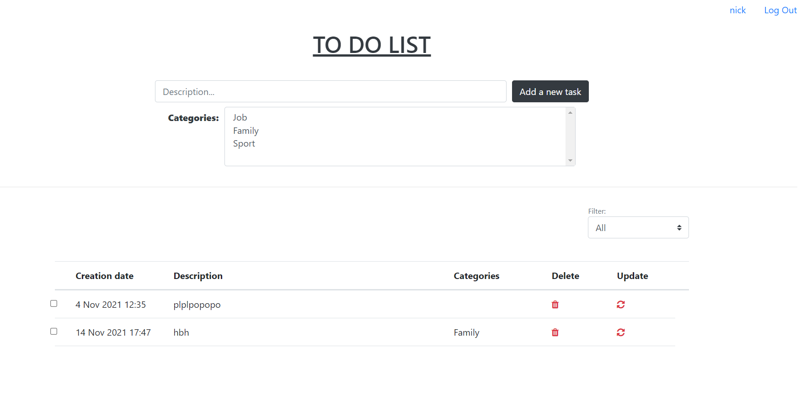

# job4j_todo

Проект представляет собой приложение "TODO список". 
Для входа необходимо выполнить авторизацию или зарегистрироваться.

На главной странице отображается список задач с датой создания, описанием, перечнем категорий,
чек-боксом "Выполнено/ Не выполнено", кнопками "Удалить" и "Обновить".

Чтобы добавить новую задачу, необходимо заполнить описание, выбрать одну или несколько категорий
и нажать кнопку "Add a new task".
По фильтру можно выбрать список выполненных, невыполненных задач или отобразить все.

